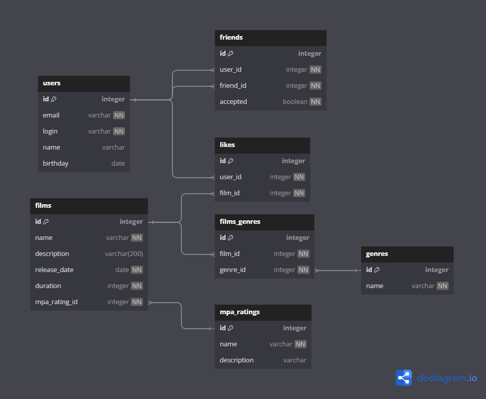

Проект filmorate
---
---

Структура БД
---


GET-запросы
---
---

Запросы для фильмов
---

- Получение всех фильмов
GET(/films)
```
SELECT *
FROM films;
```

- Получение count популярных фильмов
GET(/films/popular?count={count})
```
SELECT f.id,
       f.name,
       COUNT(l.user_id) AS rating
FROM films AS f
LEFT JOIN likes AS l ON f.id = l.film_id
GROUP BY f.id
ORDER BY rating DESC
LIMIT {count};
```

Запросы для пользователей
---

- Получение списка всех пользователей GET(/users)
```
SELECT *
FROM users;
```
- Получение списка всех друзей GET(/users/{id}/friends)
```
SELECT u.id, u.name
FROM user AS u
WHERE u.id IN (
    SELECT f.friend_id   -- Друзья, которых добавил пользователь
    FROM friends AS f
    WHERE f.user_id = {id} AND f.accepted = true
    
    UNION                
    
    SELECT f.user_id     -- Друзья, которые добавили пользователя
    FROM friends AS f
    WHERE f.friend_id = {id} AND f.accepted = true
);
```
- Получение списка друзей пользователя {id}, которые пересекаются с друзьями пользователя {otherId}
GET(/users/{id}/friends/common/{otherId})
```
SELECT u.id, u.name
FROM users AS u
WHERE u.id IN {
        -- Друзья, где оба пользователя добавили этого человека
        SELECT f1.friend_id
        FROM friends AS f1
        INNER JOIN friends AS f2 ON f1.friend_id = f2.friend_id
        WHERE f1.user_id = {id}
              AND f2.user_id = {otherId}
              AND f1.accepted = true
              AND f2.accepted = true
              AND f1.friend_id != {otherId} 
              
        UNION
        
        SELECT f1.user_id
        FROM friends f1
        INNER JOIN friends f2 ON f1.user_id = f2.user_id
        WHERE f1.friend_id = {id}
              AND f2.friend_id = {otherId}
              AND f1.accepted = true
              AND f2.accepted = true
              AND f1.user_id != {otherId}
};
```