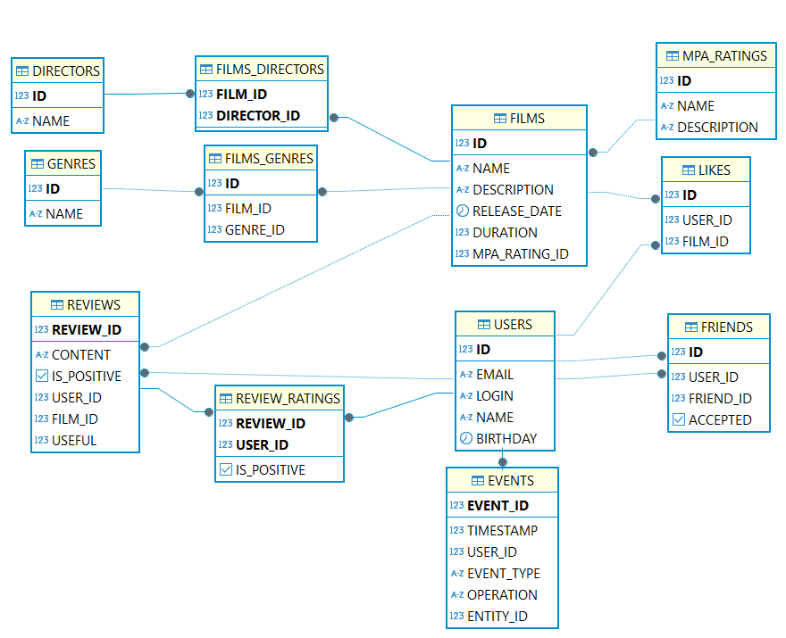

Проект filmorate
---
---

Структура БД
---


GET-запросы
---
---

Запросы для фильмов
---

- Получение всех фильмов
GET(/films)
```
SELECT *
FROM films;
```

- Получение count популярных фильмов
GET(/films/popular?count={count})
```
SELECT film_id,
       COUNT(*) AS likes_count
FROM likes
GROUP BY film_id
ORDER BY likes_count DESC, film_id
LIMIT {count};
```

Запросы для пользователей
---

- Получение списка всех пользователей GET(/users)
```
SELECT *
FROM users
ORDER BY id ASC;
```
- Получение списка всех друзей GET(/users/{id}/friends)
```
SELECT friend_id
FROM friends
WHERE user_id = {id};
```
- Получение списка друзей пользователя {id}, которые пересекаются с друзьями пользователя {otherId}
GET(/users/{id}/friends/common/{otherId})
```
SELECT f1.friend_id
FROM friends f1
JOIN friends f2 ON f1.friend_id = f2.friend_id
WHERE f1.user_id = {id} AND f2.user_id = {otherId} AND f1.accepted = true AND f2.accepted = true;
```